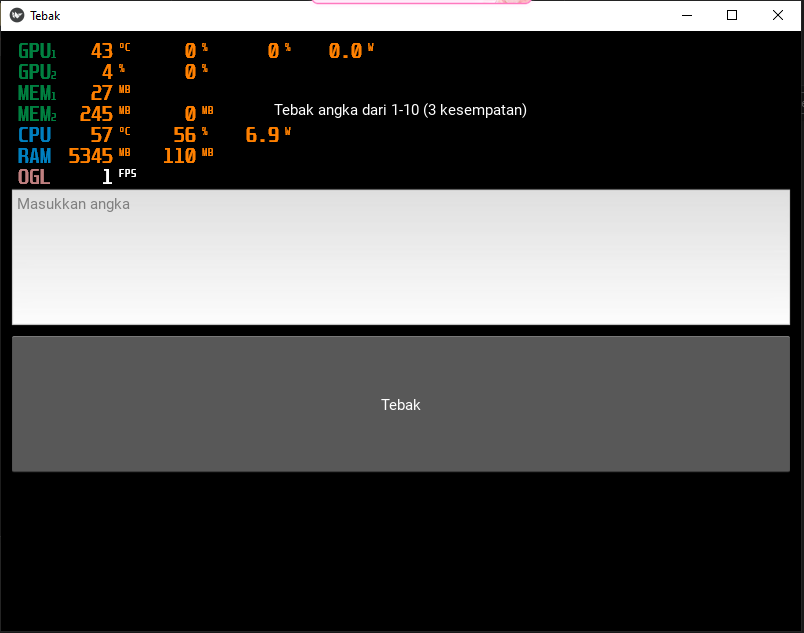

# 🎯 Game Tebak Angka

Sebuah game sederhana berbasis **Python CLI (Command Line Interface)**, di mana pemain harus menebak angka yang dipilih secara acak oleh komputer. Cocok dimainkan saat belajar pemrograman dasar atau saat butuh hiburan ringan di terminal.

---

## 🎮 Deskripsi Permainan

- Komputer akan memilih angka acak antara **1 hingga 10**.
- Pemain memiliki **3 kesempatan** untuk menebak angka tersebut.
- Setelah setiap tebakan, pemain akan diberi tahu apakah tebakan benar atau salah.
- Jika benar, pemain menang 🎉. Jika salah terus, permainan berakhir 😢.

---

## 🛠️ Teknologi yang Digunakan

| Teknologi | Keterangan |
|----------|------------|
|  | Bahasa pemrograman utama |

---

## 🚀 Cara Menjalankan Game

1. Pastikan Python telah terinstal** di perangkat Anda:
   python --version
   
2. Clone atau salin kode ke komputer Anda

3. Jalankan game di terminal:
	python tebak_angka.py
	
	
📸 Screenshot (Opsional)

### Tampilan di Terminal

🧑‍💻 Kontribusi
Pull request dan saran pengembangan sangat disambut! Jangan ragu untuk fork dan modifikasi proyek ini.

📃 Lisensi
Proyek ini bersifat open-source dan dapat digunakan untuk pembelajaran atau pengembangan lebih lanjut. 
Silakan cantumkan kredit kepada pengembang asli bila digunakan secara publik.

🙋‍♂️ Kontak Pengembang
📧 Email: [yudyasukma2@gmail.com]